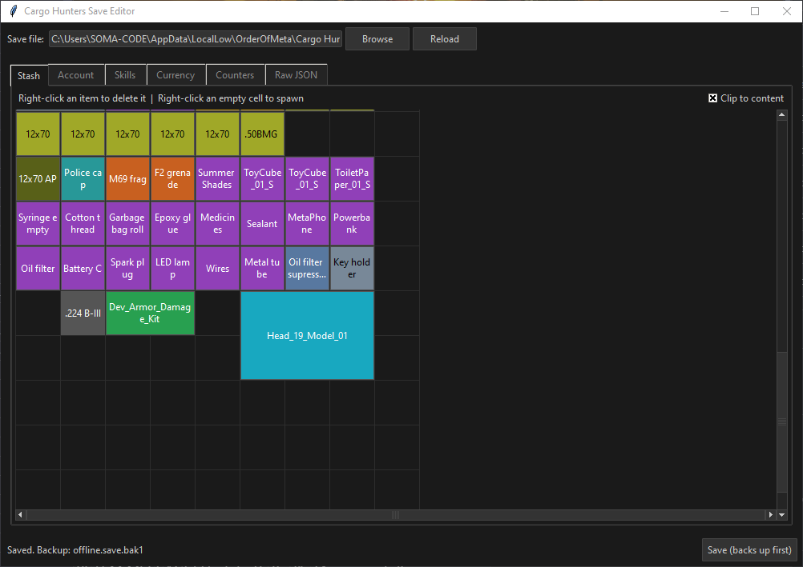
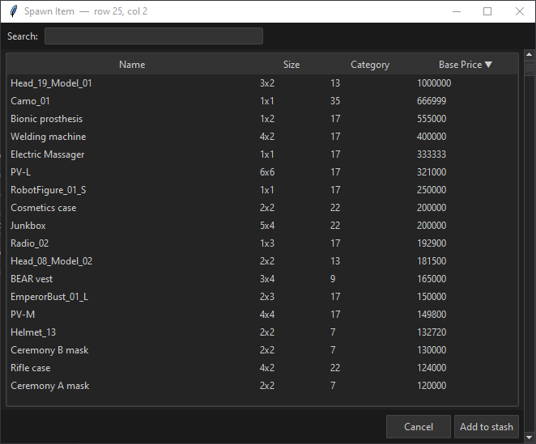
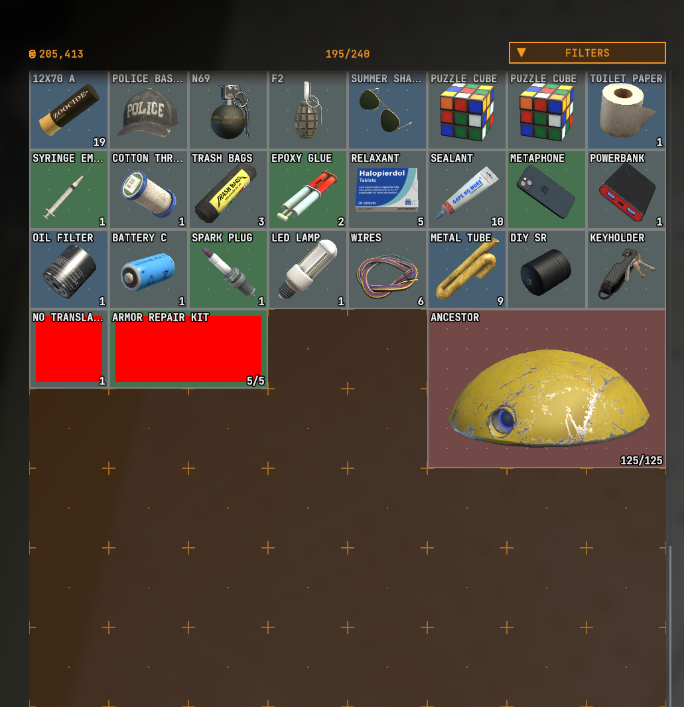

# Cargo Hunters Save Editor

##MASSIVE DISCLAIMER
###The save file backup system included in this is an afterthought. 
###You should be making manual backups of important saves before using any sort of save file editor like this.


An offline save file editor for [Cargo Hunters](https://store.steampowered.com/app/4197990/Cargo_Hunters/).



| Spawn item browser (sorted by value) | In-game stash for reference |
|---|---|
|  |  |

---

## Features

- **Stash grid** — visual drag-and-drop inventory editor with item rotation (`R`), colour coding by category, and snap-to-nearest-free-cell placement
- **Spawn items** — searchable, sortable item browser to add any item directly to your stash
- **Account** — edit nickname, level, and XP
- **Skills** — edit all skill values
- **Currency** — edit shop balances
- **Counters** — edit game stats (sessions played, enemies killed, etc.)
- **Raw JSON** — read-only view of the full save file
- **Auto-backup** — keeps the last 5 backups before every save

---

## Requirements

- Python 3.10 or newer
- `tkinter` (included with standard Python on Windows)
- No other dependencies required to run the editor

---

## Running

```bash
python editor.py
```

The editor will auto-load your save from the default location:
`%APPDATA%/../LocalLow/OrderOfMeta/Cargo Hunters/offline.save`

---

## Item database (`item_templates.json`)

The editor ships with `item_templates.json` — a list of every item in the game extracted from the game's asset bundle. This file contains item names, grid sizes, categories, and base prices. It is derived metadata, not raw game assets.

### Updating after a game patch

When the game adds new items, regenerate the database:

1. Install [UnityPy](https://github.com/K0lb3/UnityPy): `pip install unitypy`
2. Run the extraction:

```bash
python -c "
from pathlib import Path
from editor import _extract_items_db
_extract_items_db(Path('item_templates.json'))
print('Done.')
"
```

The editor will automatically attempt this extraction if `item_templates.json` is missing and UnityPy is installed.

---

## Stash grid limits

The base stash is **8 columns × 30 rows** with `AllowExpand` enabled in the game template. The editor enforces these bounds — items cannot be dragged or spawned outside them. If a pre-existing save has out-of-bounds items, you will be warned before saving; the game handles this gracefully by returning those items to your mailbox.

---

## Tools

`tools/extract_sizes.py` is a developer utility for exploring Unity asset data. It requires [UnityPy](https://github.com/K0lb3/UnityPy) and optionally [Il2CppDumper](https://github.com/Perfare/Il2CppDumper). Set the `ASSETS_DIR` path at the top of the script before running.

---

## Disclaimer

This tool is not affiliated with OrderOfMeta. Always back up your save before editing. The editor creates automatic backups, but use at your own risk.
